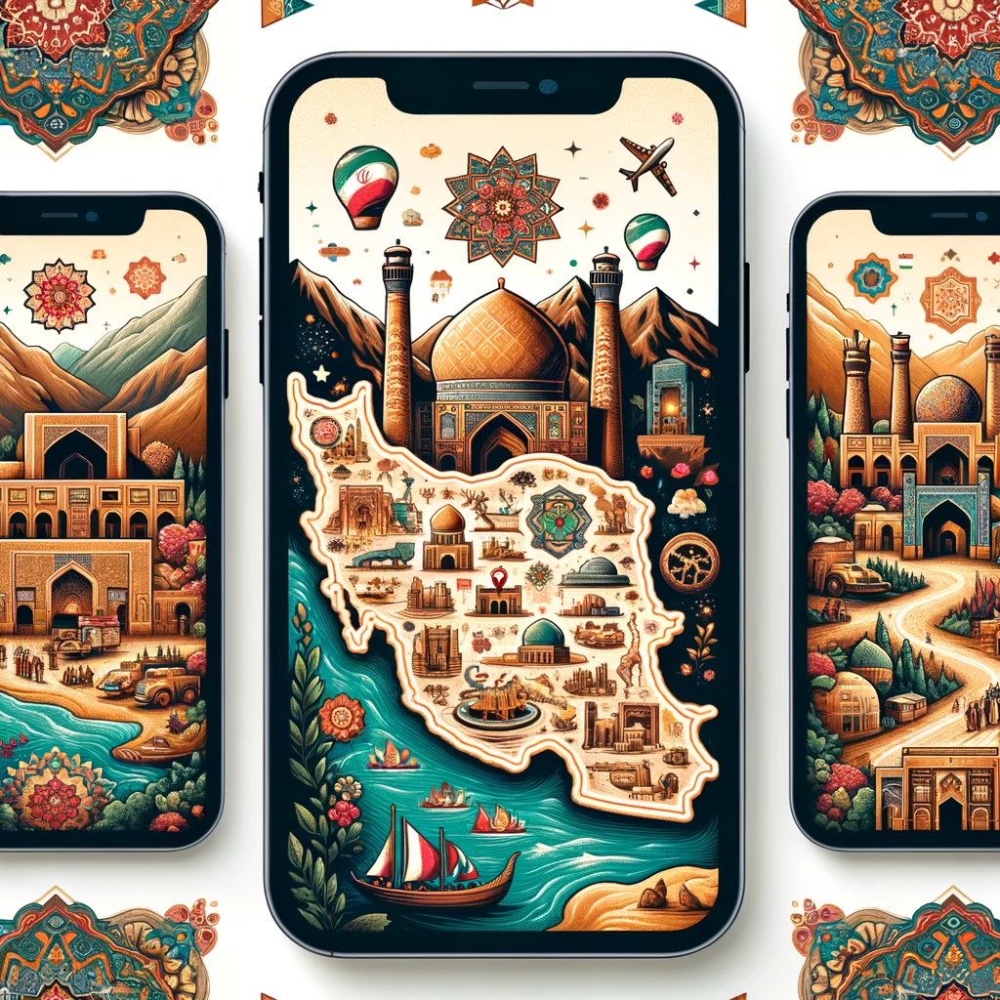
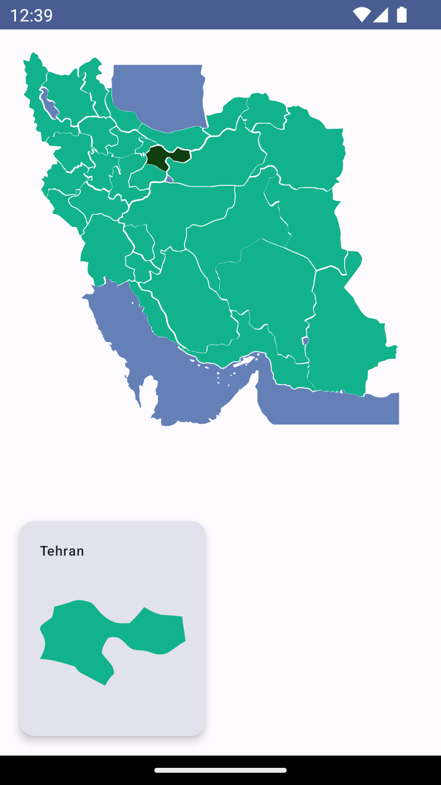

# Iran Geographic Picker

An interactive Android app built with Jetpack Compose, enabling users to explore and select geographic entities within Iran, such as provinces, cities, and landmarks. Designed to blend educational value with engaging user experience, this app opens avenues for learning about Iran's rich geography and cultural heritage.

## Features

- [x] Interactive map showcasing Iran's geographic entities.
- [x] Compact and visually appealing UI/UX.
- [x] Extendable architecture for additional features.

## Screenshot

## Future Enhancements

- [ ] **Enhanced Design**: Collaborate with designers for improved visuals.
- [ ] **Detailed Information**: Incorporate descriptions and details for each entity.
- [ ] **Expanded Content**: Add cities, landmarks, and educational content.
- [ ] **Interactive Games**: Introduce educational games focused on Iran's geography.

## Contributing

Contributions are welcome! If you're interested in enhancing the Iran Geographic Picker, feel free to fork the repository, make your changes, and submit a pull request.

## License

This project is licensed under the [MIT License](LICENSE).
